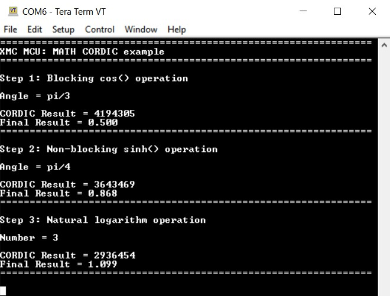

# XMC MCU: MATH CORDIC

This code example uses the MATH CORDIC block to perform circular, hyperbolic, and logarithmic operations. The example demonstrates the blocking, non-blocking, and direct register write operations of the CORDIC block.

## Requirements

- [ModusToolbox&trade; software](https://www.cypress.com/products/modustoolbox-software-environment) v2.3
- [SEGGER J-Link software](https://www.segger.com/downloads/jlink/#J-LinkSoftwareAndDocumentationPack)
- Programming Language: C
- Associated Parts: All [XMC™ 1000 MCU](https://www.infineon.com/cms/en/product/microcontroller/32-bit-industrial-microcontroller-based-on-arm-cortex-m/32-bit-xmc1000-industrial-microcontroller-arm-cortex-m0/) parts

## Supported Toolchains (make variable 'TOOLCHAIN')

- GNU Arm® Embedded Compiler v9.3.1 (`GCC_ARM`) - Default value of `TOOLCHAIN`

## Supported Kits (make variable 'TARGET')

- [XMC1400 Boot Kit](https://www.infineon.com/cms/en/product/evaluation-boards/kit_xmc14_boot_001/) (`KIT_XMC14_BOOT_001`) - Default value of `TARGET`

## Hardware Setup

This example uses the board's default configuration. See the kit user guide to ensure that the board is configured correctly.

## Software Setup

Install a terminal emulator if you don't have one. Instructions in this document use [Tera Term](https://ttssh2.osdn.jp/index.html.en).

## Theory

The CORDIC coprocessor computes trigonometric, linear, hyperbolic, and related functions using the CORDIC algorithm. The CORDIC algorithm is a useful convergence method, which performs the mathematical operations through an iterative process. The main advantage of using this algorithm is the fast calculation speed compared to software, and high accuracy. These operations are essential in applications such as the following:

- Electric power steering and motor control: angle computation

- Motor control: Park transformation

- Digital filtering and PI control loop: linear operations

The X and Y data input for the CORDIC processor can be sent directly in 'Qm.n' format. 'Q' is a binary fixed-point number format, where the number of integer bits (indicated by 'm') and the number of fractional bits (indicated by 'n') are specified. The 'Qm.n' format is generally used in hardware that does not have a floating-point unit.

In this code example, 'Q0.23' and 'Q1.22' formats are used:

- `XMC_MATH_Q0_23_t` - 1 signed bit, 0 integer bits, 23 fraction bits.

- `XMC_MATH_Q1_22_t` - 1 signed bit, 1 integer bits, 22 fraction bits.

The functions to convert the Q format to float are implemented in the code example. The theory behind the conversion is to right-shift the fractional bits to obtain the float value.

The Z input and output data also follow the same procedure for linear operations. However, for circular and hyperbolic functions, the accessible Z result data and input data are normalized. The Z input data needs to be scaled up by ((2^23)/pi). For example, if a Z input of pi/2 needs to be provided, the actual Z input that is sent to the CORDIC processor is as follows:

```
((pi/2) * ((2^23)/pi)) = 0x400000
```

On the other hand, the Z result from the CORDIC block for circular and hyperbolic functions need to be scaled down by ((2^23)/pi). For example, if the CORDIC Z output is (2^23)/pi (example considered for better understanding), the actual Z result is as follows:

```
(((2^23)/pi) / ((2^23)/pi)) = 1
```

See the following for more details of the CORDIC processor:

- [AP32307 - Math Coprocessor Application Note](https://www.infineon.com/cms/en/product/microcontroller/32-bit-industrial-microcontroller-based-on-arm-cortex-m/32-bit-xmc1000-industrial-microcontroller-arm-cortex-m0/#!?fileId=5546d4624e765da5014ed91d36911f60)

- [XMC1000 Family Technical Reference Manuals](https://www.infineon.com/cms/en/product/microcontroller/32-bit-industrial-microcontroller-based-on-arm-cortex-m/32-bit-xmc1000-industrial-microcontroller-arm-cortex-m0/#document-group-myInfineon-44)

## Using the Code Example

Create the project and open it using one of the following:

<details open><summary><b>In Eclipse IDE for ModusToolbox</b></summary>

1. Click the **New Application** link in the **Quick Panel** (or, use **File** > **New** > **ModusToolbox Application**). This launches the [Project Creator](http://www.cypress.com/ModusToolboxProjectCreator) tool.

2. Pick a kit supported by the code example from the list shown in the **Project Creator - Choose Board Support Package (BSP)** dialog.

   When you select a supported kit, the example is reconfigured automatically to work with the kit. To work with a different supported kit later, use the [Library Manager](https://www.cypress.com/ModusToolboxLibraryManager) to choose the BSP for the supported kit. You can use the Library Manager to select or update the BSP and firmware libraries used in this application. To access the Library Manager, click the link from the **Quick Panel**.

   You can also just start the application creation process again and select a different kit.

   If you want to use the application for a kit not listed here, you may need to update the source files. If the kit does not have the required resources, the application may not work.

3. In the **Project Creator - Select Application** dialog, choose the example by enabling the checkbox.

4. Optionally, change the suggested **New Application Name**.

5. Enter the local path in the **Application(s) Root Path** field to indicate where the application needs to be created.

   Applications that can share libraries can be placed in the same root path.

6. Click **Create** to complete the application creation process.

For more details, see the [Eclipse IDE for ModusToolbox User Guide](https://www.cypress.com/MTBEclipseIDEUserGuide) (locally available at *{ModusToolbox install directory}/ide_{version}/docs/mt_ide_user_guide.pdf*).

</details>

<details open><summary><b>In Command-line Interface (CLI)</b></summary>

ModusToolbox provides the Project Creator as both a GUI tool and a command line tool to easily create one or more ModusToolbox applications. See the "Project Creator Tools" section of the [ModusToolbox User Guide](https://www.cypress.com/ModusToolboxUserGuide) for more details.

Alternatively, you can manually create the application using the following steps:

1. Download and unzip this repository onto your local machine, or clone the repository.

2. Open a CLI terminal and navigate to the application folder.

   On Linux and macOS, you can use any terminal application. On Windows, open the **modus-shell** app from the Start menu.

   **Note:** The cloned application contains a default BSP file (*TARGET_xxx.mtb*) in the *deps* folder. Use the [Library Manager](https://www.cypress.com/ModusToolboxLibraryManager) (`make modlibs` command) to select and download a different BSP file, if required. If the selected kit does not have the required resources or is not [supported](#supported-kits-make-variable-target), the application may not work.

3. Import the required libraries by executing the `make getlibs` command.

Various CLI tools include a `-h` option that prints help information to the terminal screen about that tool. For more details, see the [ModusToolbox User Guide](https://www.cypress.com/ModusToolboxUserGuide) (locally available at *{ModusToolbox install directory}/docs_{version}/mtb_user_guide.pdf*).

</details>

<details open><summary><b>In Third-party IDEs</b></summary>

**Note:** Only VS Code is supported.

1. Follow the instructions from the **In Command-line Interface (CLI)** section to create the application, and import the libraries using the `make getlibs` command.

2. Export the application to a supported IDE using the `make <ide>` command.

   For a list of supported IDEs and more details, see the "Exporting to IDEs" section of the [ModusToolbox User Guide](https://www.cypress.com/ModusToolboxUserGuide) (locally available at *{ModusToolbox install directory}/docs_{version}/mtb_user_guide.pdf*).

3. Follow the instructions displayed in the terminal to create or import the application as an IDE project.

</details>


## Operation

1. Connect the board to your PC using a micro-USB cable through the debug USB connector.

2. Program the board using Eclipse IDE for ModusToolbox:

   1. Select the application project in the Project Explorer.

   2. In the **Quick Panel**, scroll down, and click **\<Application Name> Program (JLink)**.

3. Once the device is programmed, the blocking `cos()`, non-blocking `sinh()`, and `ln()` CORDIC operations are performed and the result is displayed on the serial terminal:

   **Figure 1. Serial Terminal Log**

   

## Debugging

You can debug the example to step through the code. In the IDE, use the **\<Application Name> Debug (JLink)** configuration in the **Quick Panel**. For more details, see the "Program and Debug" section in the [Eclipse IDE for ModusToolbox User Guide](https://www.cypress.com/MTBEclipseIDEUserGuide).

## Design and Implementation

This code example is divided into three steps:

- **Step 1:** This step demonstrates the use of the CORDIC processor to perform blocking operations using the `cos()` operation. The angle, pi/3 in this case, is first scaled up by `((2^23)/pi)` because it is the input to the CORDIC Z value (check the `XMC_MATH_CORDIC_Cos()` implementation in *xmc_math.c*). The result obtained from the CORDIC block is converted from the Q0_23 format to float to obtain `cos(pi/3)`.

- **Step 2:** This step demonstrates the procedure to use non-blocking CORDIC operations. Here, `sinh()` of pi/4 is calculated. The CORDIC interrupt is configured and enabled. The angle is again scaled up by `((2^23)/pi)` and then fed into the CORDIC block. Once the CORDIC operation is started, the CPU can perform other actions instead of polling such as in blocking operations. When the CORDIC operation is completed, an interrupt is triggered and the result is read. The result is then converted from Q1_22 format to float to obtain `sinh(pi/4)`.

- **Step 3:** This step uses direct register writes to perform a natural logarithmic operation. The fundamental equation behind this process is `ln(x) = 2*atanh[(x-1)/(x+1)]`. Because the `atanh()` functionality is required, the CORDIC block is used in hyperbolic vectoring mode. The initial inputs are fed into CORDIC data registers. Setting the *Start Mode* to '0' ensures that the CORDIC operation starts automatically after the X data register is written. Once the operation is complete, the final result is scaled down by `((2^23)/pi)` to obtain the result of `ln(3)`.

The result of each step and debug messages are displayed on the serial terminal.

### Resources and Settings

The project uses a custom *design.modus* file because the following settings were modified in the default *design.modus* file.

**USIC (UART) Settings**


<br>

**USIC Interrupt Settings**


<br>

**UART Tx Pin Settings**


<br>

**UART Rx Pin Settings**


<br>

## Related Resources

| Application Notes                                            |                                                              |
| :----------------------------------------------------------- | :----------------------------------------------------------- |
| [AP32307](https://www.infineon.com/cms/en/product/microcontroller/32-bit-industrial-microcontroller-based-on-arm-cortex-m/32-bit-xmc1000-industrial-microcontroller-arm-cortex-m0/#!?fileId=5546d4624e765da5014ed91d36911f60) - Math Coprocessor Application Note | Describes how to use the MATH Coprocessor for the XMC 32-bit Microcontroller |
| **Kit Guides**                                            |                                                              |
| [XMC1400 Boot Kit](https://www.infineon.com/dgdl/Infineon-Board_Users_Manual_XMC1400_Boot_Kit.pdf-UM-v01_00-EN.pdf?fileId=5546d462525dbac401527815f9a073fd) – Board User‘s Manual | Describes the schematic and hardware of XMC1400 Boot Kit for application code development on the XMC1404-Q064X0200 device.|
| **Code Examples**                                            |                                                              |
| [Using ModusToolbox](https://github.com/cypresssemiconductorco/Code-Examples-for-ModusToolbox-Software) |
| **Device Documentation**                                     |                                                              |
| [XMC1000 Family Datasheets](https://www.infineon.com/cms/en/product/microcontroller/32-bit-industrial-microcontroller-based-on-arm-cortex-m/32-bit-xmc1000-industrial-microcontroller-arm-cortex-m0/#document-group-myInfineon-49) | [XMC1000 Family Technical Reference Manuals](https://www.infineon.com/cms/en/product/microcontroller/32-bit-industrial-microcontroller-based-on-arm-cortex-m/32-bit-xmc1000-industrial-microcontroller-arm-cortex-m0/#document-group-myInfineon-44) |
| **Development Kits**                                         | Buy at www.infineon.com                                       |
| [KIT_XMC14_BOOT_001](https://www.infineon.com/cms/en/product/evaluation-boards/kit_xmc14_boot_001/) Boot Kit XMC1400 |
| **Libraries**                                                 |                                                              |
| XMC Peripheral Library (XMCLib) and docs  | [mtb-xmclib-cat3](https://github.com/cypresssemiconductorco/mtb-xmclib-cat3) on GitHub |
| **Tools**                                                    |                                                              |
| [Eclipse IDE for ModusToolbox](https://www.cypress.com/modustoolbox)     | The cross-platform, Eclipse-based IDE for IoT designers that supports application configuration and development targeting converged MCU and wireless systems.             |

## Other Resources

Infineon provides a wealth of data at www.infineon.com to help you select the right device, and quickly and effectively integrate it into your design.

For XMC MCU devices, see [32-bit XMC™ Industrial Microcontroller based on Arm® Cortex®-M](https://www.infineon.com/cms/en/product/microcontroller/32-bit-industrial-microcontroller-based-on-arm-cortex-m/).

## Document History

Document Title: *CE232787* - *XMC MCU: MATH CORDIC*

| Version | Description of Change |
| ------- | --------------------- |
| 1.0.0   | New code example      |
------

All other trademarks or registered trademarks referenced herein are the property of their respective owners.


© 2021 Infineon Technologies AG

All Rights Reserved.

### Legal Disclaimer

The information given in this document shall in no event be regarded as a guarantee of conditions or characteristics. With respect to any examples or hints given herein, any typical values stated herein and/or any information regarding the application of the device, Infineon Technologies hereby disclaims any and all warranties and liabilities of any kind, including without limitation, warranties of non-infringement of intellectual property rights of any third party.

### Information

For further information on technology, delivery terms and conditions and prices, please contact the nearest Infineon Technologies Office (www.infineon.com).

### Warnings

Due to technical requirements, components may contain dangerous substances. For information on the types in question, please contact the nearest Infineon Technologies Office.

Infineon Technologies components may be used in life-support devices or systems only with the express written approval of Infineon Technologies, if a failure of such components can reasonably be expected to cause the failure of that life-support device or system or to affect the safety or effectiveness of that device or system. Life support devices or systems are intended to be implanted in the human body or to support and/or maintain and sustain and/or protect human life. If they fail, it is reasonable to assume that the health of the user or other persons may be endangered.

-------------------------------------------------------------------------------
